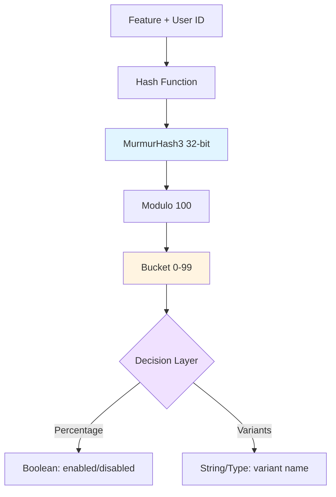
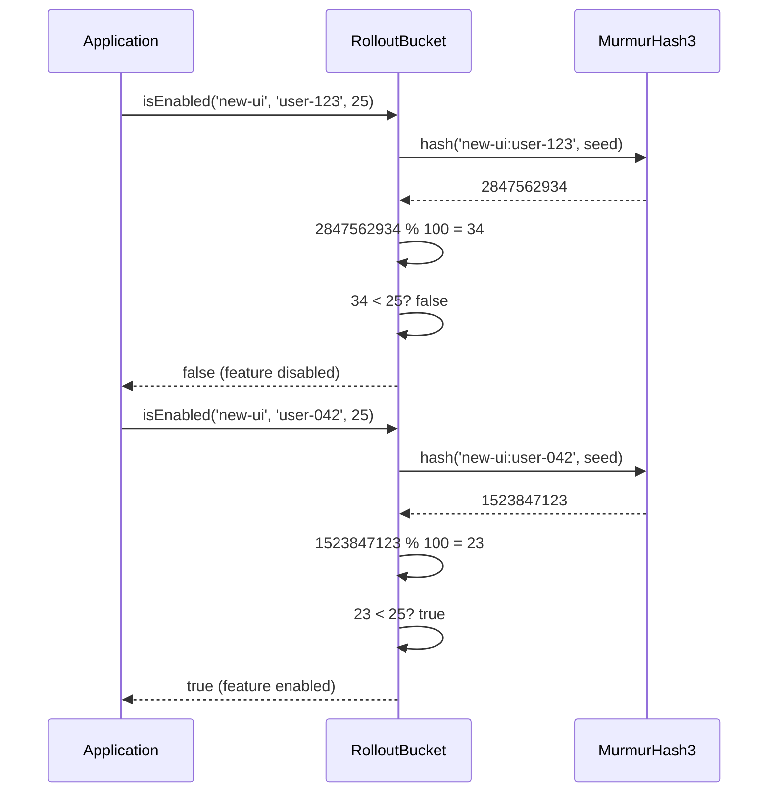
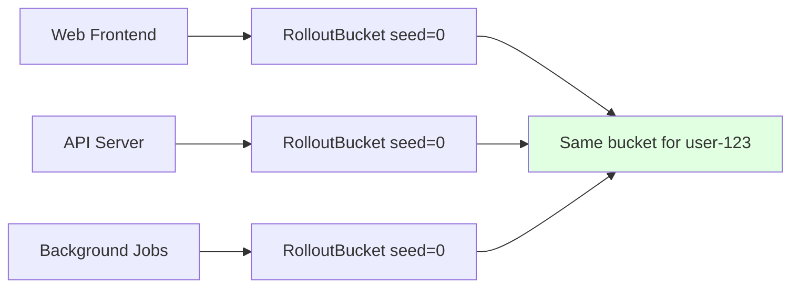

# Deterministic Feature Bucketing with MurmurHash3

## Introduction

Feature flags and A/B testing require consistent user assignment: the same user must always see the same variant across sessions, devices, and services. Most solutions rely on external state (databases, Redis, feature flag services) to maintain this consistency. This creates operational overhead, introduces latency, and adds failure points.

`rollout-bucket` solves this through deterministic hashing. By combining feature identifiers with user identifiers through MurmurHash3, it produces consistent bucket assignments (0-99) without any external state. The same inputs always yield the same bucket, enabling stateless feature rollouts and experimentation.

## Problem Space

Consider a typical feature rollout scenario: you want to enable a new UI for 25% of users. The requirements are:

1. **Determinism**: User 123 must consistently see either the old or new UI, never alternating
2. **Independence**: The 25% getting the new UI for Feature A should be uncorrelated with Feature B's rollout
3. **Uniformity**: Each percentage point should represent roughly equal user distribution
4. **Statelessness**: No database queries or service calls for every feature check

Traditional solutions use:
- **Random selection with persistence**: Generate random assignments, store in database (high operational cost)
- **Feature flag services**: External APIs like LaunchDarkly (vendor lock-in, latency, cost)
- **Naive hashing**: Simple modulo operations (often produces biased distributions)

Each approach trades off operational complexity, performance, or statistical quality.

## Solution Architecture

### Core Design

The library implements a three-layer architecture:



### Hash Algorithm Selection

MurmurHash3 was chosen over alternatives for specific technical reasons:

**Why not cryptographic hashes (SHA-256, etc.)?**
- 5-10x slower than MurmurHash3
- Cryptographic security is unnecessary (we're not protecting secrets)
- Larger output size (256+ bits vs 32 bits)

**Why not simple modulo or string hashing?**
- Poor avalanche properties (similar inputs produce similar outputs)
- Non-uniform distribution across buckets
- Higher collision rates

**MurmurHash3 characteristics:**
- Excellent avalanche: single bit change produces 50% output flip probability
- Uniform distribution validated by chi-square tests
- ~50-100ns per hash on modern hardware
- Widely adopted (Redis, Cassandra, Hadoop)

### Data Flow



## Implementation Details

### Feature Isolation

The hash input format `feature:identifier` ensures feature independence:

```typescript
// Different features produce uncorrelated buckets
getBucket('new-ui', 'user-123')      // → 34
getBucket('new-checkout', 'user-123') // → 71
getBucket('beta-search', 'user-123')  // → 12
```

Without feature names in the hash, users would always be in the same relative position across all features - the bottom 10% would always see (or miss) every new feature. Including the feature name decorrelates assignments.

### Seed-Based Distribution Control

The optional seed parameter enables multiple independent distributions:

```typescript
const prodRollout = new RolloutBucket(0);      // Production
const stagingRollout = new RolloutBucket(42);  // Staging
const testRollout = new RolloutBucket(12345);  // Test environments

// Same user, different environments, different buckets
prodRollout.getBucket('feature', 'user-1');    // → 23
stagingRollout.getBucket('feature', 'user-1'); // → 67
testRollout.getBucket('feature', 'user-1');    // → 89
```

This allows:
- Testing rollout logic without affecting production
- A/A tests (same feature, different seeds, comparing baseline metrics)
- Environment isolation

### Variant Assignment Algorithm

Multi-variant testing uses cumulative weight distribution:

```typescript
interface Variant<T> {
  name: T;
  weight: number; // 0-100
}

const variants = [
  { name: 'control', weight: 50 },   // Buckets 0-49
  { name: 'variant-a', weight: 30 }, // Buckets 50-79
  { name: 'variant-b', weight: 20 }, // Buckets 80-99
];
```

Implementation:

```typescript
getVariant<T>(feature: string, identifier: string, variants: Variant<T>[]): T | null {
  const bucket = this.getBucket(feature, identifier);

  let cumulative = 0;
  for (const variant of variants) {
    cumulative += variant.weight;
    if (bucket < cumulative) {
      return variant.name;
    }
  }

  // Fallback: if weights don't sum to 100, assign remaining buckets to last variant
  return variants[variants.length - 1]?.name ?? null;
}
```

The cumulative approach allows flexible weight distributions that don't necessarily sum to 100, providing graceful handling of configuration errors.

## Statistical Properties

### Uniformity Validation

The library includes chi-square tests validating uniform distribution across 10,000 users:

```typescript
// Expected: 100 users per bucket (10,000 users / 100 buckets)
// Actual: Chi-square statistic < 135 (99 degrees of freedom, α=0.05)
```

This ensures that "25% rollout" actually reaches 25% ± 2% of users, not 20% or 30% due to hash bias.

### Edge Case Handling

```typescript
// Percentage boundaries
isEnabled('feature', 'user', 0)    // Always false
isEnabled('feature', 'user', 100)  // Always true
isEnabled('feature', 'user', -10)  // Always false
isEnabled('feature', 'user', 150)  // Always true

// Empty inputs (valid, hash them anyway)
getBucket('', '')  // → 42 (deterministic)

// Special characters (no escaping needed)
getBucket('feature:v2', 'user@example.com')  // Works correctly
```

The design philosophy: accept all inputs, produce deterministic outputs. No validation errors for edge cases that can be handled deterministically.

## Real-World Applications

### Gradual Feature Rollout

```typescript
const rollout = new RolloutBucket();

// Week 1: Internal testing (1%)
if (rollout.isEnabled('new-search', userId, 1)) {
  useNewSearchAlgorithm();
}

// Week 2: Early adopters (10%)
// Week 3: Broader rollout (50%)
// Week 4: Full release (100%)
```

Increment the percentage parameter as confidence grows. Users already in the rollout remain in it (no flapping).

### A/B Testing

```typescript
const variant = rollout.getVariant('checkout-flow', sessionId, [
  { name: 'control', weight: 50 },
  { name: 'treatment', weight: 50 },
]);

// Track metrics by variant
analytics.track('checkout_started', { variant });
```

Consistent variant assignment enables accurate metric collection without session state.

### Canary Deployments

```typescript
// Route 5% of traffic to v2 API
const useV2 = rollout.isEnabled('api-v2', requestId, 5);

return useV2 ? apiV2.handleRequest(req) : apiV1.handleRequest(req);
```

Use request IDs (not user IDs) for per-request routing decisions.

### Multi-Service Consistency

Deploy the same seed across services to maintain consistent bucketing:



All services see the same feature state for a given user without coordination.

## Design Decisions and Trade-offs

### Why 100 Buckets?

- **Granularity**: 1% increments sufficient for most rollouts (0.1% rarely needed)
- **Mental model**: Percentages map directly to bucket count
- **Performance**: Modulo 100 is fast; larger bucket counts show diminishing returns

Alternative considered: 1000 buckets (0.1% granularity), rejected due to increased mental overhead without practical benefit.

### Why TypeScript Generics?

```typescript
// Enables type-safe variant names
const variant = rollout.getVariant('feature', userId, [
  { name: 'control' as const, weight: 50 },
  { name: 'treatment' as const, weight: 50 },
]);
// Type: 'control' | 'treatment' | null

// Prevents typos
if (variant === 'tretment') {  // TypeScript error
  // ...
}
```

Type safety reduces runtime errors in experimentation code, where typos in variant names can corrupt experiment results.

### Why No Targeting?

Targeting (segment-based assignment) was explicitly excluded to maintain simplicity:

```typescript
// NOT supported (by design):
if (user.country === 'US' && rollout.isEnabled(...)) { }
```

Targeting logic belongs in application code, not the bucketing library. This separation of concerns keeps the library focused and predictable.

## Performance Characteristics

### Benchmarks

```
Operation: getBucket()
- Hash computation: ~50-100ns per call
- Memory allocation: 0 bytes (stateless)
- Throughput: ~10-20M operations/second (single core)

Operation: isEnabled()
- Overhead: +5ns (bucket comparison)

Operation: getVariant()
- Overhead: +20-50ns (variant iteration)
```

Performance is dominated by hash computation. Modern CPUs can hash millions of feature checks per second, making this suitable for hot paths.

### Bundle Size

```
Production build: 4.8 KB minified
- rollout-bucket: 1.2 KB
- murmur-hash: 3.6 KB
- Zero transitive dependencies
```

Negligible impact on frontend bundle sizes.

## When to Use This Library

**Good fit:**
- Percentage-based feature rollouts without external dependencies
- A/B testing with consistent variant assignment
- Canary deployments and gradual migrations
- Multi-service feature consistency (same seed across services)
- Performance-critical paths (sub-microsecond overhead)

**Poor fit:**
- User targeting by attributes (location, subscription tier, etc.)
- Cryptographic applications (not cryptographically secure)
- Dynamic percentage adjustments without code deploys
- Experiment analytics and metric tracking (not included)
- Complex feature flag rules and dependencies

## Comparison to Alternatives

| Solution | Consistency | Latency | Ops Cost | Flexibility |
|----------|-------------|---------|----------|-------------|
| rollout-bucket | High | < 1µs | None | Low |
| LaunchDarkly | High | 50-200ms | High | High |
| Database flags | High | 5-20ms | Medium | Medium |
| Random + persistence | High | 10-50ms | Medium | Low |

`rollout-bucket` trades flexibility for simplicity and performance. It's the right choice when you need fast, stateless bucketing and can implement targeting logic in application code.

## Conclusion

Deterministic hashing solves the feature rollout consistency problem without operational overhead. By leveraging MurmurHash3's statistical properties and careful API design, `rollout-bucket` provides a zero-dependency, high-performance building block for feature flags and experimentation.

The library doesn't aim to replace comprehensive feature flag platforms. Instead, it serves teams that need simple, stateless bucketing without the complexity of external services. For percentage-based rollouts and A/B tests, deterministic hashing is often the right level of complexity.

## Further Reading

- [MurmurHash3 Algorithm](https://github.com/aappleby/smhasher/wiki/MurmurHash3)
- [Chi-Square Test for Uniform Distribution](https://www.itl.nist.gov/div898/handbook/eda/section3/eda3674.htm)
- [Feature Flag Best Practices](https://trunkbaseddevelopment.com/feature-flags/)
- [A/B Test Statistical Considerations](https://exp-platform.com/Documents/2013-02-CUPED-ImprovingSensitivityOfControlledExperiments.pdf)
